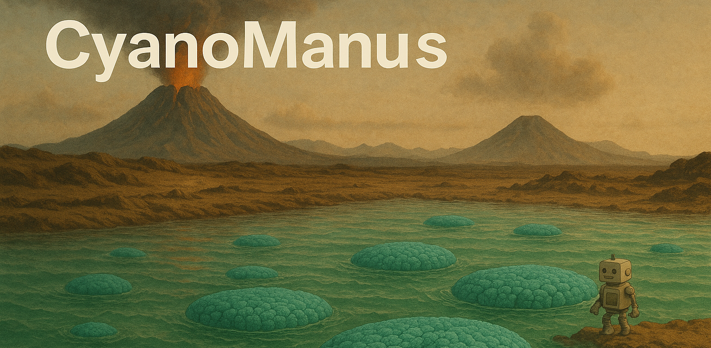

<h1 align="center">
  🤖 CyanoManus : Extensible Design Enable Adaptive Agents. Your Infinite General Purpose Multi-Agent Assistant.
</h1>

<p align="center">
  
</p>

CyanoManus is a General Purpose Multi-Agent System designed to help users leverage the capabilities of cutting-edge AI models for automating various tasks and gathering information across work and daily life scenarios. Powered by the OpenAI Agents SDK, CyanoManus features a modular architecture with decoupled design components, allowing users to freely distribute and extend the project code.

The name "CyanoManus" is derived from Cyanobacteria, reflecting our aspiration to contribute to the future development of intelligent agents. We believe this project can help advance artificial intelligence technology in a way that enables AI to collaborate with humans more naturally and profoundly to accomplish real-world tasks.

## ✨️ Core Features

## 🛠️ Installation

```bash
git clone git@github.com:yoko19191/CyanoManus.git
```

## 🚀 Quick Start

**Setup Environment Variables**

## 💡 Concepts

Building upon the existing OpenAI Agents SDK, we've abstracted the concept of Orchestrator to describe the system architecture:

- Orchestrator(constraint)
  - Guardrail (constraint)
  - Agent (modular)
    - Tools(microservice)
    - OutputType(constraint)

We've observed that traditional hierarchical determinate workflows often struggle when facing real production scenarios with scattered user input. These workflows frequently encounter unforeseen scenarios and corner cases, requiring constant prompt adjustments and component additions. This makes the entire workflow increasingly tangled and rigmarole, leading to a complexity management disaster. To prevent such issues, we advocate for less rigid structure for agents, allowing the system to explore solutions autonomously. We provide a series of adaptive components, adhering to the principle of minimal abstraction, to help users flexibly handle various challenging problems. This approach ensures the system remains controllable while being more adaptive to unseen environments.

- Adaptive Components
  - Atomic Orchestrator -> voting, react, codeact...
  - Dynamic Hooks -> various callbacks
  - Dynamic Prompt -> context management, dynamic agent instruction modification, handoff description
  - Adaptive Context Managment
  - Decorator -> hot-loading Agent InputType, OutputType...

## 👀 Demos

## 🧪 Future Plans

## 📜 License

[MIT License](LICENSE)
