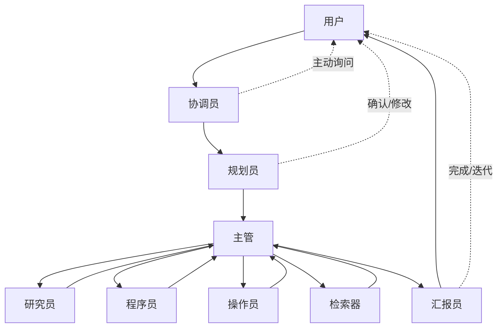
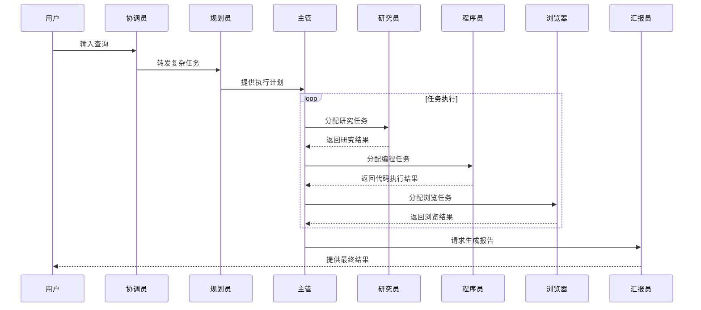

# CyanoManus

CyanoManus 是一个基于 OpenAI Agents SDK 驱动的多智能体系统。通过模块化设计和多层次结构实现了复杂任务的自动化处理，让每一个智能体专注于自己的领域，通过协作完成整体任务。

项目设计具备很强的可扩展性，允许用户自由为每个 Agent 添加工具和修改 Prompt.

从调研报告到旅游规划出行，从网页制作到数据库操作，CyanoManus 指在利用大模型强大能力，为用户提供全面的 AI 自动化解决方案。这种设计使系统能够处理复杂任务

CyanoManus 名称源于 蓝细菌(Cyanobacteria), 希望能够在如今 Agent 生态发展早期，提供一些微小作用。

## 快速开始

```bash
git clone 
cd 

uv python install 3.12
uv venv -p 3.12
uv sync
cp .env.example .env
uv run main.py
```

配置

高级配置

## 项目设计

文件结构

```plaintext
CyanoManus/
├── assets/                 # 项目资源文件
├── docs/                   # 文档
├── src/                    # 源代码
│   ├── agents/             # 智能体定义
│   ├── api/                # API接口
│   ├── config/             # 配置文件
│   ├── crawler/            # 爬虫功能
│   ├── graph/              # 工作流图定义
│   ├── prompts/            # 提示模板
│   ├── service/            # 服务层
│   ├── tools/              # 工具集合
│   └── workflow.py         # 工作流定义
├── tests/                  # 测试代码
├── main.py                 # 命令行入口
└── server.py              # 服务器入口
```

Agent 流程



1. **用户(User)** ：工作流程的起点和终点，用户提供一个明确的任务目标，或先提供一个模糊的需求在和协调员的迭代中明确任务目标。接受来自汇报员最终的结果，或者给出改进建议。
2. **协调员(Coordinator)***: 接受用户输入，触发任务流程，主动向用户询问缺失信息或澄清需求。
3. **规划员(Planner)*** : 将用户的原始或者经过协调员扩展的任务目标，拆解成可行的子任务列表。列表与用户交互确认或修改计划。
4. 主管(Supervisor) : 统筹执行阶段，管理下属的，将子任务路由何时的执行 Agent，接受子任务执行结果确认完成情况，并汇总反馈(reflection)。类似项目经理。
5. 研究员(Researcher)：执行Agent，通过各种工具搜索信息，分析信息，验证信息，并将最终的结果返回到主管。类似 Deep Researcher。
6. 程序员(Coder)：执行Agent，用于通过 CodeAct 模式高效完成编程任务，执行 Python 代码、Bash 脚本、数学计算 或 生成网页用于展示，完成结果将返回到主管。
7. 操作员(Operator)：执行Agent，负责通过 ComputerUse 和 BrowserUse 完成任务，完成情况将返回到主管。
8. 检索器(Retriever)：执行Agent，负责操作 SQL 或 RAG 的检索，检索到的内容将返回到主管。
9. **汇报员(Reporter)***：执行Agent，负责根据主管获取到的信息，汇总生成用户友好的报告、网页等形式，递交给用户。

关键交互流程

1. **用户驱动** ：任务由用户发起，最终结果返回用户。
2. **双向确认**
   * 协调员和规划员可能主动向用户请求补充信息。
   * 用户可调整计划或结果（如拒绝/修改提案）。
3. **集中管理** ：主管协调所有执行层 Agent，确保任务协同。
4. **闭环反馈** ：汇报员支持结果迭代，形成“用户→系统→用户”闭环，由用户参与的反思跌打大循环。

上下文管理：

## 例子：



更多例子在 examples 文件夹中

## 致谢

项目和 Agent 设计，很大程度上借鉴了 已经 404 的 LangManus 项目。

这个项目的得以实现离不开日益强大的基座模型 和 整个开源社区。

我们站在巨人的肩膀上，用到的开源项目有
